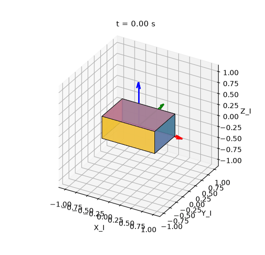

# Dynamics-calc

Milestone 1 of a GitHub-ready **rigid-body attitude** simulator: quaternion kinematics, Euler rotational dynamics, PID / LQR pointing control, and a gyro + vector-sensor estimator.

This repo is the rotational half of a 6DOF rigid-body GNC stack (state \(x = [q_{4},\,\omega_{3}]\)). Translation / rover / terrain work is out of scope. Licensed under MIT (`LICENSE`).

## Install

Python 3.10+ recommended.

```bash
python -m venv .venv
source .venv/bin/activate   # Windows: .venv\Scripts\activate
pip install -e ".[dev]"
```

Or `pip install -r requirements.txt` (runtime deps only) and keep `src/` on `PYTHONPATH`.

## SimLab usage

`python -m attitude_sim` is the SimLab entry point (`attitude_sim.sim`). It closes the loop

sensors → estimator → controller → actuator → plant (RK4)

and writes a summary PNG plus a short attitude GIF. Two named scenarios:

| `--scenario` | What it is | Default duration |
| --- | --- | --- |
| `slew` (default) | 75° rest-to-rest slew about a skewed body axis | 40 s |
| `detumble` | Tumbling initial rate, dump \(\omega\) and recover identity attitude | 30 s |

```bash
python -m attitude_sim
python -m attitude_sim --scenario detumble
python -m attitude_sim --controller lqr --estimator mekf --t-final 40
python -m attitude_sim --controller pid --estimator truth --no-gif
python -m attitude_sim --controller pid --estimator truth --angle-deg 0 \
    --tau-dist 0.002,-0.001,0.0008 --t-final 30 --no-gif
python -m attitude_sim --controller pid --estimator truth \
    --actuator-tau-max 0.02 --actuator-tau 0.05 --no-gif
python -m attitude_sim --help
```

`--angle-deg` sets the commanded principal rotation for `--scenario slew` and is ignored for `detumble`. `--tau-dist` is a constant body-frame disturbance added to the plant only.

Local runs write `{scenario}_summary.png` and `{scenario}_attitude.gif` under `outputs/` (gitignored). The recruiter-facing slew plot/GIF below are the committed copies in `docs/figures/`.

## Slew plot and GIF

**Figure: rest-to-rest slew summary** (`docs/figures/slew_summary.png`). Default stack `pid` + `mekf`, 75°, 40 s, 10 ms sample. Panels are quaternion, 3-2-1 Euler, body rate, control torque, geodesic attitude error, and estimator error.


**Figure: attitude GIF** (`docs/figures/slew_attitude.gif`). Body-fixed smallsat box in the inertial frame; body axes are X red, Y green, Z blue. Frame title is simulation time \(t\).



Regenerate the committed slew artifacts (overwrites the files in `docs/figures/`):

```bash
python -m attitude_sim --scenario slew --out-dir docs/figures
```

Detumble summary (optional; not committed by default):

```bash
python -m attitude_sim --scenario detumble --out-dir outputs --no-gif
```

## Monte Carlo robustness sweep

`python -m attitude_sim.monte_carlo` runs **N** closed-loop slews through the same `run_slew` path as the SimLab CLI. Each trial randomizes, within bounds:

- initial attitude (geodesic angle from identity ≤ `--q0-max-deg`) and body rate (cube `±--omega0-max`)
- sensor noise **seed** (per trial) and a log-uniform **scale** on gyro ARW/RRW and mag/sun σ
- optional principal-inertia perturbation (`--inertia-frac`, default ±5%; `0` disables)

It does not rewrite the plant, controllers, or estimators. Summary metrics: final geodesic attitude error (deg), a settle-time proxy (first time after which error stays below `--settle-deg`), peak `‖τ‖`, and failure counts (NaN / non-unit quaternion / diverged).

CI only runs a tiny **N=5** smoke (`tests/test_monte_carlo.py`). A larger local sweep:

```bash
# ~50 trials, default pid + mekf, 40 s, ±5% inertia
python -m attitude_sim.monte_carlo --n 50 --seed 0

# recruiter-scale local sweep with CSV/JSON
python -m attitude_sim.monte_carlo --n 200 --seed 1 --estimator mekf \
    --t-final 40 --inertia-frac 0.05 \
    --csv outputs/mc_slew.csv --json outputs/mc_slew.json

# faster checkout (truth-state feedback, shorter runs)
python -m attitude_sim.monte_carlo --n 50 --estimator truth --t-final 22
```

`--help` lists the IC / noise / inertia knobs. Failures are counted, not treated as a process error (the command still exits 0 after printing the table).

## Tests and CI

```bash
pip install -e ".[dev]"
pytest
ruff check src tests
pytest --cov=attitude_sim --cov-report=term-missing
```

GitHub Actions (`.github/workflows/ci.yml`):

- **ruff** on Python 3.12 (`ruff check src tests`). Rules live in `[tool.ruff]` in `pyproject.toml`: E/F/W/I/UP/B/RUF. `E501` (line length), `E741` (name `I` for principal inertia), and RUF001–003 (unicode minus/times/sigma in scientific comments) are ignored so CI does not mass-reformat the tree.
- **pytest + coverage** on Python **3.10, 3.11, and 3.12**. Line coverage of the `attitude_sim` package must stay at or above **80%** (`pytest-cov`, `[tool.coverage.report] fail_under = 80`). Measured **91%** on `main` after Monte Carlo #6, harden #7, and actuator #8 (Python 3.12); the floor is a modest buffer, not a freeze of that number. `plots.py` (GIF renderer) is the largest uncovered slice. `__main__.py` is omitted from the denominator.
- CLI smoke: no-plot SimLab slew, detumble, LQR+Mahony, PID hold with `--tau-dist`, actuator saturation/lag, plus a tiny Monte Carlo entry (`python -m attitude_sim.monte_carlo --n 5`, short `t_final`, `--diverge-deg 180` so a 0.2 s run is scored for numerical health rather than settling).

Behavioral coverage includes quaternion unit-norm and double-cover, 3-2-1 Euler principal-axis checks, RK4 fourth-order scalar checks, torque-free energy / inertial-momentum invariants with documented tolerances, a spherical-body constant-torque closed form, a work–energy trapezoid check, axisymmetric closed-form precession, inertia validation (principal axes, triangle inequalities), estimator noise-model and filter-vs-plant checks (`pytest tests/test_estimation.py tests/test_sensors.py`), closed-loop slew on truth and on MEKF / Mahony estimates, detumble rate-dump on truth and MEKF, a constant body-torque hold (PID nulls the bias and the logged command cancels \(\tau_d\); LQR holds a small proportional residual), per-axis reaction-wheel saturation (`tests/test_actuators.py`: applied \(|\tau_i|\) never exceeds \(\tau_{\max}\); unlimited/no-lag matches prior closed-loop torque), and a tiny N=5 Monte Carlo harness smoke (`pytest tests/test_monte_carlo.py`). Control-law design notes live in [`docs/controls.md`](docs/controls.md).

## Equations (what the SimLab integrates)

These are the rigid-body equations stepped by `attitude_sim.plant` and the error used by `attitude_sim.controls`. The CLI does not re-derive them; `--controller` / `--estimator` only switch which module produces \(\tau\) and \((\hat{q},\hat{\omega})\).

Scalar-first unit quaternions \(q = [q_{w},\,q_{x},\,q_{y},\,q_{z}]\) with the Hamilton product. Body vectors map to inertial coordinates as \(v_{I} = R(q)\, v_{b}\).

**Kinematics** (body rate \(\omega\), pure quaternion \(\hat{\omega}=[0,\,\omega]\)):

\[
\dot{q} = \tfrac{1}{2}\, q \otimes \hat{\omega}.
\]

**Euler rotational dynamics** with body inertia \(J=J^{\top}\succ 0\) and external control torque \(\tau\):

\[
J \dot{\omega} = \tau - \omega \times (J\omega),\qquad
\dot{\omega} = J^{-1}\bigl(\tau - \omega \times (J\omega)\bigr).
\]

Principal moments of \(J\) are required to satisfy the physical triangle inequalities \(I_i+I_j\ge I_k\).

**RK4** (classical fourth-order, step \(h\), zero-order-hold \(\tau\)):

\[
\begin{aligned}
k_1 &= f(t,\,y),\\
k_2 &= f(t+h/2,\,y+(h/2)k_1),\\
k_3 &= f(t+h/2,\,y+(h/2)k_2),\\
k_4 &= f(t+h,\,y+h k_3),\\
y^+ &= y + (h/6)\,(k_1+2k_2+2k_3+k_4).
\end{aligned}
\]

After each step \(q\leftarrow q/\|q\|\). RK4 is not symplectic; torque-free first integrals are the rotational kinetic energy \(T=\tfrac12\omega\cdot(J\omega)\) and the inertial angular momentum \(h_I=R(q)\,J\omega\) (and \(|h_b|=|J\omega|\)). See `attitude_sim.plant` and `tests/test_plant.py` for the documented conservation tolerances. The SimLab CLI holds \(\tau\) ZOH over each sample.

**Attitude error** (both controllers):

\[
q_{e} = q_{\mathrm{des}}^{\ast} \otimes \hat{q},\qquad
e_{q} = \operatorname{sign}(q_{e0})\, q_{e,1:3},\qquad
\delta\theta \approx 2 e_{q}.
\]

**PID** (inertia-scaled PD plus integral, optional gyroscopic cancellation, torque saturation, gated anti-windup):

\[
\tau = -K_{p} e_{q} - K_{d}(\hat{\omega}-\omega_{\mathrm{des}}) - K_{i} z + \omega \times J\omega,\qquad |\tau|\le\tau_{\max}.
\]

Defaults use \(e_{q}\approx\theta/2\) so the rotation-vector loop has \(\omega_{n},\,\zeta\): \(K_{p} = 2\omega_{n}^{2} J\), \(K_{d} = 2\zeta\omega_{n} J\), \(K_{i} = \tfrac12\omega_{n}^{3} J\) with \(\omega_{n}=0.5\,\mathrm{rad/s}\), \(\zeta=1\). That \(\omega_{n}\) puts the opening 75° PD torque on the \(0.02\,\mathrm{N\cdot m}\) actuator. The integrator is gated to \(\|e_{q}\|\le 0.10\) so it rejects a body-frame bias without winding up on the slew.

**LQR** on the rest linearization \(x=[\delta\theta,\,\omega]\), \(u=\tau\):

\[
A = \begin{bmatrix} 0 & I \\ 0 & 0 \end{bmatrix},\qquad
B = \begin{bmatrix} 0 \\ J^{-1} \end{bmatrix},\qquad
\tau = -K x + \omega \times J\omega,\qquad |\tau|\le\tau_{\max}.
\]

Default \(Q,R\) are Bryson placeholders (\(1/\theta_{\mathrm{ref}}^{2}\), \(1/\omega_{\mathrm{ref}}^{2}\), \(1/\tau_{\max}^{2}\) with \(\theta_{\mathrm{ref}}=0.25\,\mathrm{rad}\)). \(K\) is the CARE gain from `scipy.linalg.solve_continuous_are`, or a supplied \(3\times 6\) matrix. No integrator: a constant disturbance leaves \(\delta\theta_{\mathrm{ss}}\approx K_{\theta}^{-1}\tau_{d}\).

See [`docs/controls.md`](docs/controls.md) for the gain-vs-inertia argument.

**Sensors.** Rate gyro \(\omega_{m} = \omega + b + \eta_{v}\) with bias random walk \(\dot{b}=\eta_{u}\) (ARW density \(\sigma_{v}\), RRW density \(\sigma_{u}\); optional readout \(\eta_{n}\)). Optional magnetometer / sun stubs return noisy unit vectors \(v_{b} = R(q)^{\top} v_{I} + \eta\).

**Estimation** (`--estimator`; see [docs/estimation.md](docs/estimation.md) for the noise / process-noise story):

- `mekf` — 6-state multiplicative EKF (\(\delta\alpha\), gyro bias) with Farrenkopf \(Q_d\) and sequential vector updates. SimLab forwards `SimConfig.gyro_sigma_v` / `gyro_sigma_u` into that \(Q_d\) so the filter process noise matches the truth gyro.
- `mahony` — complementary SO(3) observer with the same sensors; controller rate is \(\hat\omega=\omega_m-\hat b\). Also exported as `attitude_sim.MahonyFilter`.
- `truth` — full-state feedback (no estimator), for plant/controller checkout.

Gyro-only (`--no-mag --no-sun` with `mekf` / `mahony`) is allowed but warns: full attitude is not observable from rate alone.

The controller always consumes \((\hat{q},\,\hat{\omega})\) from the selected source. The programmatic entry point is `attitude_sim.run_sim` (alias of `run_slew`).

**Actuator** (optional; default unlimited / no lag so prior closed-loop runs match).  After the PID/LQR command, `attitude_sim.actuators` clips each axis to \(\pm\tau_{\max,i}\) (reaction-wheel limits) and can apply a first-order lag \(\dot\tau=(u-\tau)/T\).  Logged \(\tau\) is the applied wheel torque.  CLI: `--actuator-tau-max` (scalar or `x,y,z`) and `--actuator-tau` (seconds).  This is independent of the controller Euclidean \(|\tau|\le\tau_{\max}\) clamp; see [`docs/controls.md`](docs/controls.md).

## Architecture

```
sensors  →  estimator (MEKF / Mahony / truth)
                 ↓
            controller (PID | LQR)  →  τ_cmd
                 ↓
            actuator (per-axis clip, optional lag)  →  τ
                 ↓
            rigid-body plant (RK4)  →  q, ω
                 ↓
            sensors
```

| Module | Role |
| --- | --- |
| `attitude_sim.quaternions` | Hamilton product, kinematics, DCM, 3-2-1 Euler |
| `attitude_sim.plant` | `RigidBody`, inertia helpers (principal axes / validation), Euler equation, RK4 |
| `attitude_sim.controls` | PID and CARE LQR, `--controller` switch |
| `attitude_sim.actuators` | Per-axis \(\pm\tau_{\max}\) clip + optional first-order lag |
| `docs/controls.md` | Error quaternion, PID/LQR equations, gain-vs-inertia, wheels |
| `attitude_sim.sensors` | Gyro + unit-vector mag/sun models |
| `attitude_sim.estimation` | MEKF and Mahony complementary filter |
| `attitude_sim.sim` | SimLab scenarios + CLI (`slew`, `detumble`); `run_sim` / `run_slew` |
| `attitude_sim.monte_carlo` | Closed-loop Monte Carlo / noise-sweep harness (`python -m attitude_sim.monte_carlo`) |
| `attitude_sim.plots` | `{scenario}_summary.png` and `{scenario}_attitude.gif` |

Default inertia is a smallsat-class principal tensor \(\mathrm{diag}(0.05,\,0.06,\,0.07)\,\mathrm{kg\,m}^{2}\). Sample is 10 ms.

## Controller / estimator matrix

| `--controller` | `--estimator` | What it demonstrates |
| --- | --- | --- |
| `pid` | `truth` | Plant + quaternion PD/PID |
| `lqr` | `truth` | Linearized LQR pointing |
| `pid` or `lqr` | `truth` | Body-torque hold: `--angle-deg 0 --tau-dist …` |
| `pid` or `lqr` | `mekf` | Control on Kalman estimates (default) |
| `pid` or `lqr` | `mahony` | Control on complementary-filter estimates |
