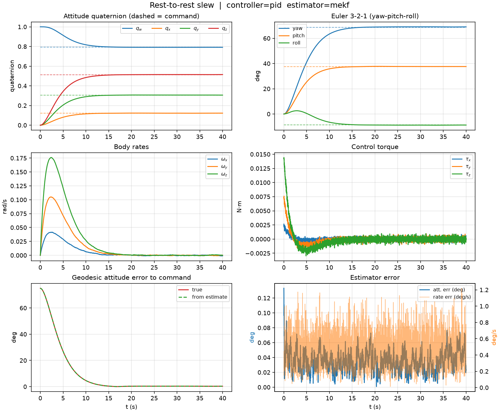
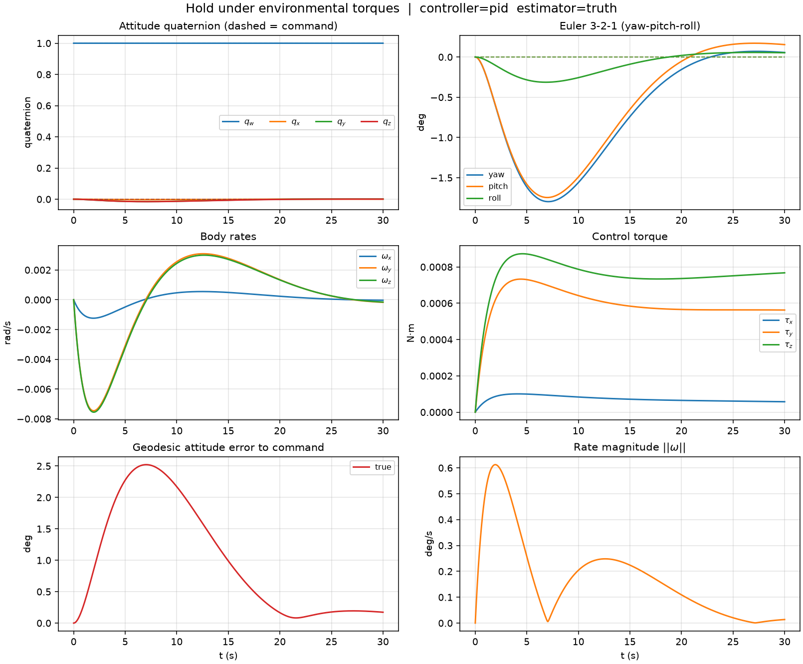
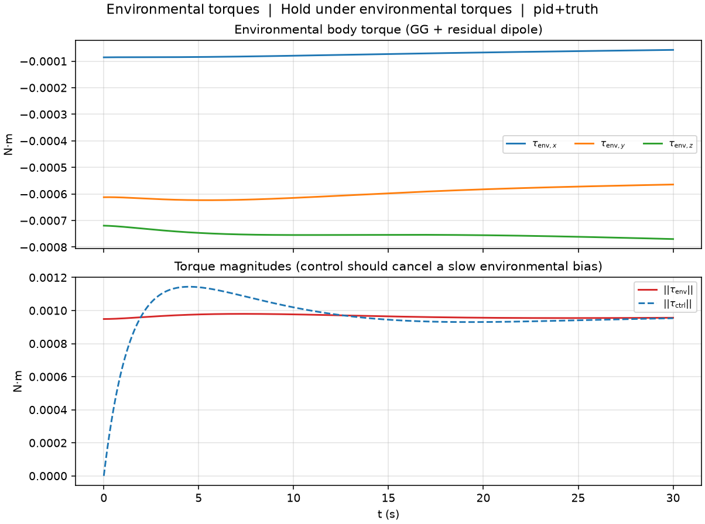
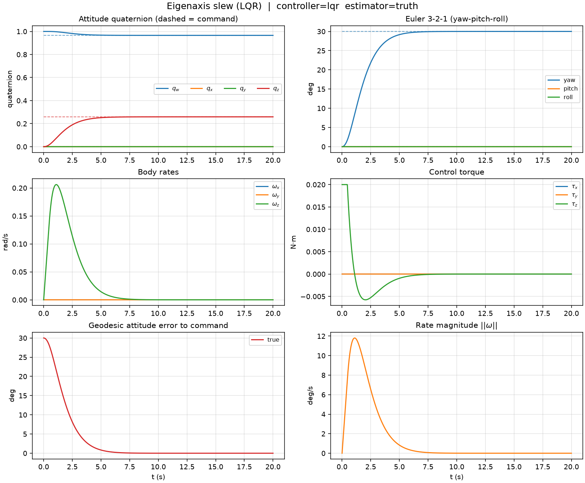
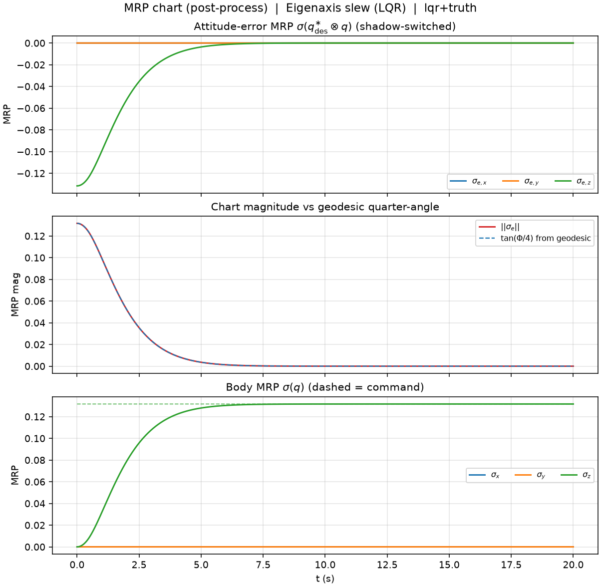
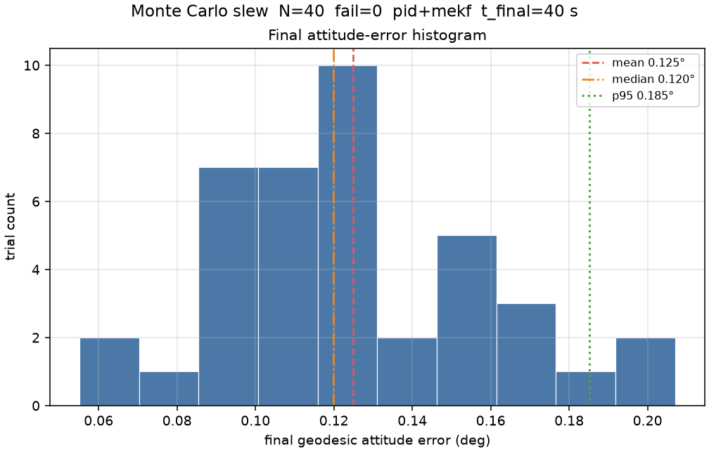
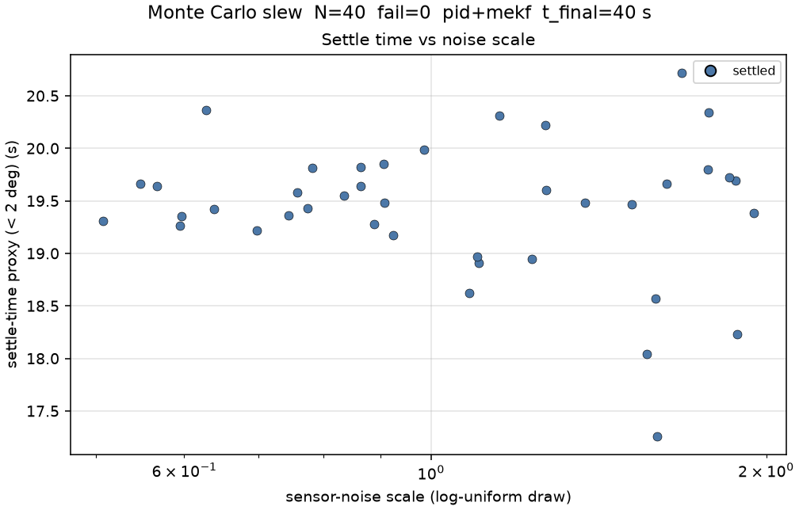

# Dynamics-calc (Python reference implementation)

> **This is the original Python/NumPy implementation.** The primary product is now the Rust + web app at the repository root (see the [top-level README](../README.md)) — a from-scratch rewrite validated against this package (`engine/tests/python_parity.rs`). This directory is kept as the correctness oracle, the source of the golden test fixtures, and a complete, independently useful CLI/library in its own right; it is not being actively extended going forward.

Milestone 1 of a GitHub-ready **rigid-body attitude** simulator: quaternion kinematics, Euler rotational dynamics, PID / LQR pointing control, and a gyro + vector-sensor estimator.

This repo is the rotational half of a 6DOF rigid-body GNC stack (state \(x = [q_{4},\,\omega_{3}]\)). Translation / rover / terrain work is out of scope. Licensed under MIT (`LICENSE`).

## Install

Python 3.10+ recommended.

```bash
python -m venv .venv
source .venv/bin/activate   # Windows: .venv\Scripts\activate
pip install -e ".[dev]"
```

Or `pip install -r requirements.txt` (runtime deps only) and keep `src/` on `PYTHONPATH`.

## SimLab usage

`python -m attitude_sim` is the SimLab entry point (`attitude_sim.sim`). It closes the loop

sensors → estimator → controller → actuator → plant (RK4)

and writes a summary PNG plus a short attitude GIF. Four named scenarios. A lightweight notebook that runs the CLIs and embeds the committed figures (slew + Monte Carlo from PR #10, plus hold / eigenaxis pack plots) is [`notebooks/simlab_demo.ipynb`](notebooks/simlab_demo.ipynb).

| `--scenario` | What it is | Default duration | Default controller |
| --- | --- | --- | --- |
| `slew` (default) | 75° rest-to-rest slew about a skewed body axis | 40 s | PID |
| `detumble` | Tumbling initial rate, dump \(\omega\) and recover identity attitude | 30 s | PID |
| `hold` | Identity hold under `EnvironmentalTorques` (gravity-gradient + demo-scale residual dipole) | 30 s | PID |
| `eigenaxis` | Rest-to-rest principal-axis (body \(z\)) slew; `--angle-deg` default 30 | 20 s | **LQR** |

`python -m attitude_sim --list-scenarios` prints the same catalog. Monte Carlo remains **slew-only**.

```bash
python -m attitude_sim
python -m attitude_sim --scenario detumble
python -m attitude_sim --scenario hold
python -m attitude_sim --scenario eigenaxis
python -m attitude_sim --list-scenarios
python -m attitude_sim --controller lqr --estimator mekf --t-final 40
python -m attitude_sim --controller pid --estimator truth --no-gif
python -m attitude_sim --controller pid --estimator truth --angle-deg 0 \
    --tau-dist 0.002,-0.001,0.0008 --t-final 30 --no-gif
python -m attitude_sim --controller pid --estimator truth \
    --actuator-tau-max 0.02 --actuator-tau 0.05 --no-gif
python -m attitude_sim --controller pid --estimator truth \
    --actuator-tau-max 0.02 --rw-h-max 0.004 --rw-visc 1e-6 --no-gif
python -m attitude_sim --controller pid --estimator truth --angle-deg 0 \
    --tau-dist 0.002,-0.001,0.0008 --actuator-h-dump 0.01 --no-gif
python -m attitude_sim --coarse-init --no-gif
python -m attitude_sim --coarse-init --coarse-init-method quest --no-gif
python -m attitude_sim --gyro-sigma-v 1e-3 --gyro-sigma-u 2e-6 \
    --mag-sigma 0.01 --sun-sigma 0.005 --no-gif
python -m attitude_sim --controller pid --estimator truth \
    --gravity-gradient --residual-dipole --no-gif
python -m attitude_sim --controller pid --estimator truth \
    --gravity-gradient --residual-dipole --actuator-tau-max 0.008 --no-gif
python -m attitude_sim --controller pid --estimator truth \
    --aerodynamic --srp --no-gif
python -m attitude_sim --log-innovations outputs/slew_nis.csv --no-gif
python -m attitude_sim --scenario slew --env --mrp-plot --no-gif
python -m attitude_sim --help
```

`--angle-deg` sets the commanded principal rotation for `--scenario slew` (default 75°) and `--scenario eigenaxis` (default 30°). It is ignored for `detumble` and `hold`. `--tau-dist` is a constant body-frame disturbance added to the plant only. `--gravity-gradient` / `--residual-dipole` / `--aerodynamic` / `--srp` are **off by default** so prior demos match; `--scenario hold` and `--env` turn GG + residual dipole on. Models are evaluated ZOH after the actuator (`step_rigid_body` unchanged). `--no-env` turns GG/dipole off. `--mrp-plot` writes `{stem}_mrp.png` from logged \(q\) (on by default for `hold` / `eigenaxis`); this is a post-process MRP chart, not a plant-state change.

| Flag | CLI behavior |
| --- | --- |
| `--dt` | Sample / RK4 step (s). Must be `> 0`; otherwise argparse exits with an error (not a traceback). |
| `--tau-dist` | Three comma-separated body-frame disturbance torques `[N·m]` (e.g. `0.002,-0.001,0.0008`). Wrong arity or non-floats → argparse error. Logged `τ` is the control command; `τ_d` is plant-only. |
| `--gravity-gradient` / `--residual-dipole` / `--aerodynamic` / `--srp` | Opt-in environmental models from `attitude_sim.disturbances`. Default **off** except GG+dipole on `--scenario hold` / `--env`. Orbit knobs: `--orbit-radius` (m, default `7e6`), `--orbit-inc-deg`, `--orbit-raan-deg`. Dipole: `--dipole-m` (`A·m²`; hold uses a demo-scale default) and `--dipole-model` `tilted` / `orbit_normal`. Panel: `--panel-area` (m², default `0.4`), `--panel-rcp` (m, default `0.05,0,0.02`), `--aero-cd` (default `2.2`), `--srp-cr` (default `1`), `--srp-eclipse` `off` / `on` / `cylindrical`. Sampled ZOH at \(t_k\) and added with \(\tau_d\). Logged \(\tau\) still excludes them; `{stem}_env_torque.png` shows \(\tau_{\mathrm{env}}\). |
| `--env` / `--no-env` | Convenience aliases: enable/disable GG + residual dipole. `hold` enables them by default. |
| `--mrp-plot` | Extra `{stem}_mrp.png`: shadow-switched \(\sigma(q_e)\) reconstructed from logged quaternions. Default on for `hold` / `eigenaxis`. |
| `--no-mag --no-sun` | Gyro-only. Allowed; `mekf` / `mahony` emit a `UserWarning` because full attitude is not observable from rate. `truth` does not sample sensors and does not warn. |
| `--gyro-sigma-v` / `--gyro-sigma-u` | Truth-gyro ARW/RRW densities (rad/s/√Hz, rad/s²/√Hz). SimLab copies the same values into the MEKF Farrenkopf \(Q_d\) (`make_sim_estimator`). MC has the same flags as the *base* before `--noise-scale-*`. |
| `--mag-sigma` / `--sun-sigma` | Vector-stub Cartesian σ; filter \(R\) follows via `vectors_from_sensors`. |
| `--log-innovations PATH` | Optional MEKF vector NIS CSV (default off). Rank-2 unit-vector NIS; Mahony/truth skip with a warning. |

Local runs write `{scenario}_summary.png` and `{scenario}_attitude.gif` under `outputs/` (gitignored). The recruiter-facing slew plot/GIF below are the committed copies in `docs/figures/`.

## Slew plot and GIF

**Figure: rest-to-rest slew summary** (`docs/figures/slew_summary.png`). Default stack `pid` + `mekf`, 75°, 40 s, 10 ms sample. Panels are quaternion, 3-2-1 Euler, body rate, control torque, geodesic attitude error, and estimator error.



**Figure: attitude GIF** (`docs/figures/slew_attitude.gif`). Body-fixed smallsat box in the inertial frame; body axes are X red, Y green, Z blue. Frame title is simulation time \(t\).


Regenerate the committed slew artifacts (overwrites the files in `docs/figures/`):

```bash
python -m attitude_sim --scenario slew --out-dir docs/figures
```

Detumble summary (optional; not committed). Hold / eigenaxis recruiter PNGs **are** committed under `docs/figures/`:

```bash
python -m attitude_sim --scenario detumble --out-dir outputs --no-gif
python -m attitude_sim --scenario hold --out-dir docs/figures --no-gif
python -m attitude_sim --scenario eigenaxis --out-dir docs/figures --no-gif
```

**Figure: hold under environmental torques** (`docs/figures/hold_summary.png`). PID + truth, 30 s identity hold. Demo-scale residual dipole \(\sim 1\,\mathrm{mN\cdot m}\); the integrator cancels \(\tau_{\mathrm{env}}\).



**Figure: environmental torque** (`docs/figures/hold_env_torque.png`). Logged \(\tau_{\mathrm{env}}\) vs control magnitude.



**Figure: eigenaxis LQR slew** (`docs/figures/eigenaxis_summary.png`). LQR + truth, 30° about body \(z\), 20 s.



**Figure: MRP post-process chart** (`docs/figures/eigenaxis_mrp.png`). \(\sigma(q_e)\) reconstructed from logged \(q\) (plant still on S^3).



CI does **not** smoke the attitude GIF (Pillow is slow). Agg-backend PNGs are covered in pytest (`tests/test_monte_carlo.py`, `tests/test_docs_figures.py`, `tests/test_plot_helpers.py`).

## Monte Carlo robustness sweep

`python -m attitude_sim.monte_carlo` runs **N** closed-loop **slews** through the same `run_slew` path as the SimLab CLI. Detumble / hold / eigenaxis (`--scenario …`) are single-run SimLab checkouts and are **out of Monte Carlo scope**.

Each trial randomizes, within bounds:

- initial attitude (geodesic angle from identity ≤ `--q0-max-deg`) and body rate (cube `±--omega0-max`)
- sensor noise **seed** (per trial) and a log-uniform **scale** on gyro ARW/RRW and mag/sun σ
- optional principal-inertia perturbation (`--inertia-frac`, default ±5%; `0` disables)

It does not rewrite the plant, controllers, or estimators. Failures are counted, not treated as a process error (the command still exits 0 after printing the table). `--help` lists the IC / noise / inertia knobs. Optional Controls knobs on the **same** harness (defaults off): `--tau-dist-max` samples a constant body disturbance, and `--gain-scale-min` / `--gain-scale-max` log-uniformly scale the implemented PID gains or LQR \(K\). `--rw-sat-stress` (or `--rw-h-max` / `--actuator-tau-max`) turns on the reaction-wheel assembly so trials can saturate stored momentum under noisy sensors.

Each trial applies the #38 cubesat helpers (`tune_pid_second_order` / `bryson_lqr_costs` via `cubesat_gain_report` and `cubesat_controller_kwargs`) to the **sampled** inertia so PID \(K_p,K_d,K_i\) and LQR \(Q,R\) match that plant. That is the same path `run_slew` uses; CLI flags are unchanged.

### Metrics

| Metric | Meaning |
| --- | --- |
| final geodesic attitude error (deg) | \(\delta\theta\) to the commanded slew attitude at `t_final` |
| settle-time proxy (s) | first time after which error stays below `--settle-deg` (NaN if it never holds) |
| peak \(\\|\tau\\|\) | max control-torque magnitude on the trial |
| peak \(\\|\omega\\|\) | max body-rate magnitude on the trial |
| RW sat fraction | fraction of samples with any-axis \(\|τ\|\) or \(\|h_w\|\) at a configured wheel limit (0 if the clip-only actuator is used) |
| failures | `nan` / `non_unit_quat` / `diverged` (final error > `--diverge-deg` or \(\\|\omega\\|\) blow-up) |

The printed table reports mean / median / p95 of **healthy** (non-failed) final errors, mean settle time over trials that actually settled, peak-torque max/mean over finite trials, peak body rate, and mean RW saturation fraction.

CI only runs a tiny **N=5** smoke (`tests/test_monte_carlo.py`). A larger local sweep:

```bash
# ~50 trials, default pid + mekf, 40 s, ±5% inertia
python -m attitude_sim.monte_carlo --n 50 --seed 0

# recruiter-scale local sweep with CSV/JSON + figures
python -m attitude_sim.monte_carlo --n 200 --seed 1 --estimator mekf \
    --t-final 40 --inertia-frac 0.05 \
    --csv outputs/mc_slew.csv --json outputs/mc_slew.json \
    --plot --out-dir outputs

# faster checkout (truth-state feedback, shorter runs)
python -m attitude_sim.monte_carlo --n 50 --estimator truth --t-final 22

# LQR gain / disturbance robustness (same harness)
python -m attitude_sim.monte_carlo --n 50 --controller lqr --estimator truth \
    --gain-scale-min 0.8 --gain-scale-max 1.25 --tau-dist-max 0.002

# RW saturation + noisy sensors (same harness; tight |τ| / |h| + τ_d fill)
python -m attitude_sim.monte_carlo --rw-sat-stress --n 20 --seed 0 --estimator mekf \
    --t-final 12 --csv outputs/mc_rw.csv --json outputs/mc_rw.json
```

### MC figures (PR #10)

Committed recruiter copies live under `docs/figures/mc_*.png` (N=40 `pid`+`mekf` sweep, `--seed 0`, 40 s, ±5% inertia). The demo notebook links the same files: [`notebooks/simlab_demo.ipynb`](notebooks/simlab_demo.ipynb).

**Figure: final attitude-error histogram** (`docs/figures/mc_final_att_error_hist.png`). Healthy-trial geodesic error at `t_final`, with mean / median / p95 markers.



**Figure: settle time vs noise scale** (`docs/figures/mc_settle_vs_noise.png`). Settle-time proxy against the log-uniform sensor-noise scale. Circles settled inside `--settle-deg`; triangles never held the band (plotted at `t_final`); crosses failed.



Regenerate the committed MC figures (overwrites the PNGs in `docs/figures/`). `--plot` is opt-in; `--out-dir` is the figure directory (same flag as the SimLab CLI):

```bash
python -m attitude_sim.monte_carlo --n 40 --seed 0 --estimator mekf \
    --t-final 40 --inertia-frac 0.05 \
    --plot --out-dir docs/figures \
    --json outputs/mc_slew.json --csv outputs/mc_slew.csv
```

Re-plot from a previous harness JSON (no new trials):

```bash
python -m attitude_sim.monte_carlo --from-json outputs/mc_slew.json \
    --plot --out-dir docs/figures
```

## Tests and CI

```bash
pip install -e ".[dev]"
pytest
make lint          # ruff
make typecheck     # mypy src
make coverage      # pytest-cov, 80% floor, coverage.xml
```

GitHub Actions (`.github/workflows/ci.yml`):

- **lint** on Python 3.12: `ruff check src tests` and `mypy src`. Ruff rules live in `[tool.ruff]`: E/F/W/I/UP/B/RUF. `E501` (line length), `E741` (name `I` for principal inertia), and RUF001–003 (unicode minus/times/sigma in scientific comments) are ignored so CI does not mass-reformat the tree. Ruff does not run `format`. Mypy is scoped to `src/attitude_sim` on **Python 3.12** (`ignore_missing_imports` only for matplotlib and scipy) so current numpy stubs parse; runtime/pytest still cover 3.10–3.12.
- **pytest + coverage** on Python **3.10, 3.11, and 3.12**. Line coverage of the `attitude_sim` package must stay at or above **80%** (`pytest-cov`, `[tool.coverage.report] fail_under = 80`). The 3.12 job also uploads `coverage.xml` as an artifact. Measured **91%** on `main` after Monte Carlo #6, harden #7, actuator #8, and plant #9 (Python 3.12); the floor is a modest buffer, not a freeze of that number. `plots.py` (GIF renderer) is the largest uncovered slice. `__main__.py` is omitted from the denominator.
- **packaging**: `python -m build`, install the wheel, `import attitude_sim`.
- CLI smoke: no-plot / **no-GIF** SimLab slew, detumble, **hold**, **eigenaxis**, LQR+Mahony, PID hold with `--tau-dist`, actuator saturation/lag, RW `--rw-h-max`, optional `--actuator-h-dump` hold, gravity-gradient + residual-dipole + wheel box, aero + SRP, MEKF `--log-innovations`, `--list-scenarios`, plus a tiny Monte Carlo entry (`python -m attitude_sim.monte_carlo --n 5`, short `t_final`, `--diverge-deg 180` so a 0.2 s run is scored for numerical health rather than settling; only slew is in the MC harness) and a 3-trial `--rw-sat-stress` smoke. Attitude GIF rendering is not a CI gate.

Behavioral coverage includes quaternion unit-norm and double-cover, 3-2-1 Euler principal-axis checks, RK4 fourth-order scalar checks, torque-free energy / inertial-momentum invariants with documented tolerances, a spherical-body constant-torque closed form, a work–energy trapezoid check, a discrete angular-momentum theorem \(\Delta h_I\approx\int R(q)\tau\,dt\), axisymmetric closed-form precession, inertia validation (principal axes, triangle inequalities), a library hinged-appendage / 1-DOF flex plant (`tests/test_flex.py`: \(\theta=0\) reduces toward the rigid hub, free oscillation \(\approx\sqrt{k/I_{\mathrm{eff}}}\), energy decay with damping), estimator noise-model and filter-vs-plant checks (`pytest tests/test_estimation.py tests/test_sensors.py`), closed-loop slew on truth and on MEKF / Mahony estimates, detumble rate-dump on truth and MEKF, named `hold` under `EnvironmentalTorques` (PID cancels \(\tau_{\mathrm{env}}\)) and named `eigenaxis` LQR slew (`tests/test_scenarios.py`), a constant body-torque hold (PID nulls the bias and the logged command cancels \(\tau_d\); LQR holds a small proportional residual), opt-in gravity-gradient / residual-dipole / aero / SRP closed-loop wiring (default off except GG+dipole on hold / `--env`; logged \(\tau\) excludes \(\tau_{\mathrm{env}}\)), per-axis reaction-wheel saturation (`tests/test_actuators.py`: applied \(|\tau_i|\) never exceeds \(\tau_{\max}\); unlimited/no-lag matches prior closed-loop torque), reaction-wheel momentum storage / dump / saturation (`tests/test_reaction_wheels.py`), a disturbed+saturated slew smoke, gravity-gradient / residual-dipole / aero / SRP analytic zeros (`tests/test_disturbances.py`), a tiny N=5 Monte Carlo harness smoke (`pytest tests/test_monte_carlo.py`), Agg-backend MC / MRP / env-torque plot-helper coverage (`tests/test_plot_helpers.py`), and a check that committed `docs/figures/mc_*.png` plus slew figures exist (`tests/test_docs_figures.py`; missing copies regenerate Agg PNGs in tmp, never GIFs). Control-law design notes live in [`docs/controls.md`](docs/controls.md). `--estimator truth` still skips gyro/vector sampling (including when env models are on).

## Equations (what the SimLab integrates)

These are the rigid-body equations stepped by `attitude_sim.plant` and the error used by `attitude_sim.controls`. The CLI does not re-derive them; `--controller` / `--estimator` only switch which module produces \(\tau\) and \((\hat{q},\hat{\omega})\).

Scalar-first unit quaternions \(q = [q_{w},\,q_{x},\,q_{y},\,q_{z}]\) with the Hamilton product. Body vectors map to inertial coordinates as \(v_{I} = R(q)\, v_{b}\).

**Kinematics** (body rate \(\omega\), pure quaternion \(\hat{\omega}=[0,\,\omega]\)):

\[
\dot{q} = \tfrac{1}{2}\, q \otimes \hat{\omega}.
\]

**Modified Rodrigues Parameters** (optional chart, `attitude_sim.mrp`; not the SimLab state). \(\sigma = q_{1:3}/(1+q_w)=\hat e\tan(\Phi/4)\). Inverse \(q_w=(1-\sigma^2)/(1+\sigma^2)\), \(q_{1:3}=2\sigma/(1+\sigma^2)\). Shadow set \(\sigma^s=-\sigma/\|\sigma\|^2\) is the same attitude (the opposite quaternion); switch when \(\|\sigma\|\) exceeds 1 (configurable) so the chart stays away from the \(\Phi=\pm 360^\circ\) pole. DCM \(R(\sigma)=R(q(\sigma))\) with this repo’s \(v_I=R\,v_b\). Kinematics

\[
\dot\sigma = \tfrac14 B(\sigma)\,\omega,\qquad
B(\sigma)=(1-\sigma^2)I + 2[\sigma\times] + 2\sigma\sigma^{\top}.
\]

SimLab may write `{stem}_mrp.png` from logged \(q\) (`plot_mrp_error`; `--mrp-plot`, default on for `hold` / `eigenaxis`). That is post-process only — the integrator state stays \(x=[q,\omega]\).

**Euler rotational dynamics** with body inertia \(J=J^{\top}\succ 0\) and external control torque \(\tau\):

\[
J \dot{\omega} = \tau - \omega \times (J\omega),\qquad
\dot{\omega} = J^{-1}\bigl(\tau - \omega \times (J\omega)\bigr).
\]

Principal moments of \(J\) are required to satisfy the physical triangle inequalities \(I_i+I_j\ge I_k\).

**Torque-free polhode / energy–Casimir** (`attitude_sim.polhode`; library helpers, not a SimLab CLI flag). When \(\tau=0\), Euler's equation conserves rotational kinetic energy and the Lie–Poisson Casimir \(|h|^2\), and the inertial vector \(h_I\) is fixed:

\[
T=\tfrac12\omega\cdot(J\omega),\qquad
h_b=J\omega,\qquad
h_I=R(q)\,J\omega,\qquad
|h|^2=|h_b|^2=|h_I|^2.
\]

Body-frame \(\omega(t)\) therefore stays on the intersection of the inertia ellipsoid \(\omega^{\top}J\omega=2T\) and the momentum ellipsoid \((J\omega)\cdot(J\omega)=|h|^2\) (the **polhode**). Mapped inertially, \(\omega_I=R(q)\omega\) traces the **herpolhode** in the invariable plane \(\omega_I\cdot h_I=2T\). Principal-axis spin is linearly stable about the min and max principal moments and unstable about the intermediate axis (tennis-racket / intermediate-axis theorem). Linearization about \(\omega=\Omega\,e_k\) with \(\{i,j,k\}=\{1,2,3\}\) gives

\[
\lambda^2=-\frac{(I_k-I_i)(I_k-I_j)}{I_i I_j}\,\Omega^2
\]

(\(\lambda^2<0\) oscillatory / stable, \(\lambda^2>0\) hyperbolic / unstable). See `attitude_sim.polhode` and `tests/test_polhode.py`.

**Environmental torques** (`attitude_sim.disturbances`; opt-in SimLab flags, default **off** except `--scenario hold` / `--env`, independent of the constant `--tau-dist` bias). Orbit frame: \(\hat r\) zenith (Earth→s/c), \(\hat h\) orbit normal \(r\times v\), nadir \(-\hat r\). Body vectors are \(v_b=R(q)^{\top}v_I\). Gravity-gradient (circular or given orbit state)

\[
\tau_{\mathrm{gg}} = 3\frac{\mu}{r^{3}}\,(\hat r_b \times J\hat r_b)
\]

vanishes when a principal axis of \(J\) lies along nadir/zenith. Residual dipole \(\tau_m=m_b\times B_b\) with \(B_b=R(q)^{\top}B_I\) and \(B_I\) either a tilted Earth dipole or \(B_I=(\mu_m/r^{3})\hat h\) (orbit-normal / equatorial-dipole option). Parallel \(m\) and \(B\) give zero torque.

Aerodynamic torque on a simple panel / box (or ram-aligned cannonball) is \(\tau_{\mathrm{aero}}=r_{\mathrm{cp}}\times\bigl(-\tfrac12\rho |v_{\mathrm{rel}}|^{2} C_d A\,\hat n\bigr)\). Density is an exponential atmosphere \(\rho(h)=\rho_{\mathrm{ref}}\exp(-(h-h_{\mathrm{ref}})/H)\) with a ~400 km LEO mean default (not NRLMSISE). \(\hat n=\hat v_{\mathrm{rel}}\) when omitted; \(r_{\mathrm{cp}}\parallel F\) (including \(r_{\mathrm{cp}}=0\)) gives zero torque. Solar radiation pressure is \(\tau_{\mathrm{srp}}=r_{\mathrm{cp}}\times(P_{\mathrm{srp}} c_r A\cos\theta\,\hat u_{\mathrm{sun}})\) with \(P_{\mathrm{srp}}\approx 4.56\times10^{-6}\,\mathrm{N/m}^{2}\) at 1 AU and an umbra on/off eclipse stub (`eclipse=True` or `'cylindrical'` Earth shadow). Library: call `τ_body(q, ω, t)` with a bound `CircularOrbit`, or pass `orbit=OrbitState(...)`. SimLab: `--gravity-gradient` / `--residual-dipole` / `--aerodynamic` / `--srp` (ZOH at \(t_k\), added with \(\tau_d\); GG/dipole default off except `--scenario hold` / `--env`; aero/SRP still opt-in). The hold preset uses a **demo-scale** residual dipole (\(\sim 40\,\mathrm{A\cdot m}^{2}\)) so \(|\tau_{\mathrm{env}}|\) is millinewton-metres on this smallsat \(J\).

**RK4** (classical fourth-order, step \(h\), zero-order-hold \(\tau\)):

\[
\begin{aligned}
k_1 &= f(t,\,y),\\
k_2 &= f(t+h/2,\,y+(h/2)k_1),\\
k_3 &= f(t+h/2,\,y+(h/2)k_2),\\
k_4 &= f(t+h,\,y+h k_3),\\
y^+ &= y + (h/6)\,(k_1+2k_2+2k_3+k_4).
\end{aligned}
\]

After each step \(q\leftarrow q/\|q\|\). RK4 is not symplectic; torque-free first integrals are the rotational kinetic energy \(T=\tfrac12\omega\cdot(J\omega)\) and the inertial angular momentum \(h_I=R(q)\,J\omega\) (and \(|h_b|=|J\omega|\)). With applied torque the discrete theorem is \(\Delta h_I\approx\int R(q)\tau_b\,dt\) (`inertial_torque` / `trapezoid_inertial_impulse`). See `attitude_sim.plant` and `tests/test_plant.py` for the documented conservation tolerances. The SimLab CLI holds \(\tau\) (and, when enabled, \(\tau_{\mathrm{env}}\)) ZOH over each sample. An optional Munthe–Kaas RKMK4 step exists on the plant library (`step_rigid_body(..., method="rkmk4")` / `rkmk4_step`); it is **not** exposed as a SimLab CLI flag, so `python -m attitude_sim` stays on default RK4.

**Dual-spin / gyrostat** (`attitude_sim.gyrostat`; library plant, **not** a SimLab CLI flag). Locked-rotor inertia \(J\) plus one body-fixed rotor axis \(\hat a\) with relative momentum \(h_w=h\hat a=I_w\Omega\hat a\):

\[
J\dot\omega+\omega\times(J\omega+h_w)+\dot h_w=\tau,\qquad
\dot\omega=J^{-1}\bigl(\tau-\omega\times(J\omega+h_w)-\dot h_w\bigr).
\]

Constant-speed (or commanded constant \(h_w\)) has \(\dot h_w=0\). A variable-speed wheel uses \(I_w\dot\Omega=\tau_w\) and \(\dot h_w=\tau_w\hat a\). \(h_w=0\) reduces to Euler's equation on `RigidBody`. Torque-free first integrals at constant \(h_w\) are the carrier Hamiltonian \(T=\tfrac12\omega\cdot(J\omega)\) and \(H_I=R(q)(J\omega+h_w)\) (and \(|H|=|J\omega+h_w|\)). Spin about the rotor axis is an equilibrium; the transverse mode about a principal axis \(e_k\) is \(\lambda^2=-[(I_k-I_i)\Omega+h][(I_k-I_j)\Omega+h]/(I_i I_j)\) (large \(|h|\) can stabilize the intermediate axis). Optional RK4 steps `step_gyrostat` (\(\omega\), optional \(\Omega\)) and `step_gyrostat_attitude`. See `attitude_sim.gyrostat` and `tests/test_gyrostat.py`.

**Hinged appendage / 1-DOF flexure** (`attitude_sim.flex`; library plant, **not** a SimLab CLI flag). Rigid hub \(J_h\) plus one hinged rigid panel (hinge at the hub CM, axis \(\hat a\), small-angle flexure \(\theta\)). Lagrangian about \(\hat a\) (hub angle \(\psi\), \(I_h=1/(\hat a^{\top}J_h^{-1}\hat a)\), panel hinge inertia \(I_p\), stiffness \(k\), damping \(c\)):

\[
T=\tfrac12 I_h\dot\psi^2+\tfrac12 I_p(\dot\psi+\dot\theta)^2,\qquad
V=\tfrac12 k\theta^2,\qquad
\begin{bmatrix}I_h+I_p&I_p\\I_p&I_p\end{bmatrix}
\begin{bmatrix}\ddot\psi\\\ddot\theta\end{bmatrix}
=
\begin{bmatrix}\tau_a\\-k\theta-c\dot\theta\end{bmatrix}.
\]

Free–free modal frequency \(\omega_n=\sqrt{k/I_{\mathrm{eff}}}\) with \(I_{\mathrm{eff}}=I_h I_p/(I_h+I_p)\). Newton–Euler in 3-D: \(H=J_h\omega+I_p(\omega\cdot\hat a+\dot\theta)\hat a\), \(J_h\dot\omega=\tau+(k\theta+c\dot\theta)\hat a-\omega\times H\). At \(\theta=\dot\theta=0\), \(\omega=0\) this reduces to Euler on the hub. Rest linearization \(x=[\omega,\theta,\dot\theta]\) is `linearized_flex_state_space`. Optional RK4: `step_flex` / `step_flex_attitude`. See `attitude_sim.flex` and `tests/test_flex.py`.

**Attitude error** (both controllers):

\[
q_{e} = q_{\mathrm{des}}^{\ast} \otimes \hat{q},\qquad
e_{q} = \operatorname{sign}(q_{e0})\, q_{e,1:3},\qquad
\delta\theta \approx 2 e_{q}.
\]

**PID** (inertia-scaled PD plus optional integral, gyroscopic cancellation, torque saturation, anti-windup):

\[
\tau = -K_{p} e_{q} - K_{d}(\hat{\omega}-\omega_{\mathrm{des}}) - K_{i} z + \omega \times J\omega,\qquad |\tau|\le\tau_{\max}.
\]

Defaults use \(e_{q}\approx\theta/2\) so the rotation-vector loop has \(\omega_{n},\,\zeta\): \(K_{p} = 2\omega_{n}^{2} J\), \(K_{d} = 2\zeta\omega_{n} J\), \(K_{i} = \tfrac12\omega_{n}^{3} J\) with \(\omega_{n}=0.5\,\mathrm{rad/s}\), \(\zeta=1\). That \(\omega_{n}\) puts the opening 75° PD torque on the \(0.02\,\mathrm{N\cdot m}\) actuator. The integrator is gated to \(\|e_{q}\|\le 0.10\) and, when \(K_i\) is used, does not wind up under Euclidean or per-axis (`clip_torque`) saturation (conditional freeze; optional `kaw` back-calculation). Optional `shape_pid_command` can soft-limit eigenaxis rate / \(|\dot\tau|\).

**LQR** on the rest linearization \(x=[\delta\theta,\,\omega]\), \(u=\tau\):

\[
A = \begin{bmatrix} 0 & I \\ 0 & 0 \end{bmatrix},\qquad
B = \begin{bmatrix} 0 \\ J^{-1} \end{bmatrix},\qquad
\tau = -K x + \omega \times J\omega,\qquad |\tau|\le\tau_{\max}.
\]

Default \(Q,R\) are Bryson placeholders (\(1/\theta_{\mathrm{ref}}^{2}\), \(1/\omega_{\mathrm{ref}}^{2}\), \(1/\tau_{\max}^{2}\) with \(\theta_{\mathrm{ref}}=0.25\,\mathrm{rad}\)). \(K\) is the CARE gain from `attitude_sim.controls.solve_care` (`scipy.linalg.solve_continuous_are`, numpy Hamiltonian fallback at `method="numpy"`), or a supplied \(3\times 6\) matrix. `design_attitude_lqr` is the one-shot linearize-and-solve helper; `AttitudeLQR` is an alias of `LQRAttitudeController`. No integrator: a constant disturbance leaves \(\delta\theta_{\mathrm{ss}}\approx K_{\theta}^{-1}\tau_{d}\).

See [`docs/controls.md`](docs/controls.md) for the gain-vs-inertia argument and the cubesat-scale **gain / cost tuning report** (`tune_pid_second_order`, `bryson_lqr_costs`, `cubesat_gain_report`).

**Sensors.** Rate gyro \(\omega_{m} = \omega + b + \eta_{v}\) with bias random walk \(\dot{b}=\eta_{u}\) (ARW density \(\sigma_{v}\), RRW density \(\sigma_{u}\); optional readout \(\eta_{n}\)). Optional magnetometer / sun / star-tracker stubs return noisy unit vectors \(v_{b} = R(q)^{\top} v_{I} + \eta\). Inertial references stay constant (no IGRF). FOV / eclipse gating:

\[
\cos\alpha = \hat v_b\cdot\hat b_{\mathrm{bore}},\qquad
\text{available iff not occulted and }(\alpha_{\mathrm{FOV}}=\emptyset\text{ or }\cos\alpha\ge\cos\alpha_{\mathrm{FOV}}).
\]

`measure` returns `None` when the sample is unavailable (sun `eclipse` / `occulted`, or outside the half-cone about `boresight_body`). `star_tracker` defaults to an 8° half-cone. TRIAD / MEKF drop gated vectors; fewer than two available pairs degrades to `try_triad_q0_from_sensors → None` (SimLab `--coarse-init` keeps true \(q_0\)).

**Estimation** (`--estimator`; see [docs/estimation.md](docs/estimation.md) for the noise / process-noise / NEES story):

- `mekf` — 6-state multiplicative EKF (\(\delta\alpha\), gyro bias) with Farrenkopf \(Q_d\) and sequential vector updates. SimLab forwards `SimConfig.gyro_sigma_v` / `gyro_sigma_u` into that \(Q_d\) so the filter process noise matches the truth gyro. Consistency: ensemble NEES should be \(\chi^2_6\) under matched *open-loop* noise; vector NIS should be \(\chi^2_2\) (rank-2 tangent plane) with documented bounds in the unit tests. Closed-loop NEES/NIS are looser smokes only — control coupling / unmatched \(\tau\) are not a \(\chi^2\) proof. `--log-innovations PATH` writes the pre-update NIS table.
- `mahony` — complementary SO(3) observer with the same sensors; controller rate is \(\hat\omega=\omega_m-\hat b\). Also exported as `attitude_sim.MahonyFilter`.
- `truth` — full-state feedback (no estimator), for plant/controller checkout. SimLab skips gyro and vector-sensor sampling on this path.

Default SimLab still initializes MEKF/Mahony at the true \(q_0\). `--coarse-init` (or `SimConfig.coarse_init=True`) runs a lost-in-space coarse align on mag+sun at \(t=0\) so the filter need not start at truth; `--coarse-init-method {triad,quest,davenport}` selects Wahba TRIAD (default, two-vector) or QUEST / Davenport q-method (all available vectors, weights \(1/\sigma^2\)). Fewer than two available vectors falls back to \(q_0\). Omit both flags to keep the true-\(q_0\) demo.

Gyro-only (`--no-mag --no-sun` with `mekf` / `mahony`) is allowed but warns: full attitude is not observable from rate alone.

The controller always consumes \((\hat{q},\,\hat{\omega})\) from the selected source. The programmatic entry point is `attitude_sim.run_sim` (alias of `run_slew`).

**Actuator** (optional; default unlimited / no lag / no dump so prior closed-loop runs match).  After the PID/LQR command, `attitude_sim.actuators` clips each axis to \(\pm\tau_{\max,i}\) (reaction-wheel limits) and can apply a first-order lag \(\dot\tau=(u-\tau)/T\).  Optional `--actuator-h-dump` (N·m·s) adds a deadzone wheel-momentum dump that uses leftover box authority and a paired \(\tau_{\mathrm{ext}}\) so attitude / PID anti-windup stay intact.  Logged \(\tau\) is the applied wheel torque.  CLI: `--actuator-tau-max` (scalar or `x,y,z`), `--actuator-tau` (seconds), `--actuator-h-dump`, `--actuator-dump-gain`.  This is independent of the controller Euclidean \(|\tau|\le\tau_{\max}\) clamp; see [`docs/controls.md`](docs/controls.md).

**Magnetic torquer** (library-only, not a SimLab CLI flag).  `attitude_sim.magnetic` models a three-axis dipole with per-axis \(|m_i|\le m_{\max,i}\):

\[
m=\frac{B\times\tau_{\mathrm{cmd}}}{\|B\|^{2}},\qquad
m\leftarrow\mathrm{clip}(m,\,\pm m_{\max}),\qquad
\tau=m\times B.
\]

\(\tau\) is always orthogonal to \(B\).  Optional remanent \(m_{\mathrm{res}}\) is handed to the existing residual-dipole disturbance (`residual_dipole_handoff` → `ResidualDipoleTorque`) so commanded and leftover dipoles share \(\tau=m\times B\).

**Reaction-wheel assembly** (optional; `--rw-h-max` / `--rw-inertia` / `--rw-visc`).  Additive `attitude_sim.reaction_wheels` sits on the same actuator path and stores wheel momentum \(h_w=I_w\Omega\).  Motor torque is the reaction of \(\tau_{\mathrm{cmd}}\) after \(|\tau|\) and \(|h|\) saturation, plus viscous / smoothed Coulomb friction

\[
I_w\dot\Omega=\tau_m+\tau_f+\tau_{\mathrm{dump}},\qquad
\tau_f=-b\Omega-c\tanh(\Omega/\varepsilon),\qquad
\tau=-\dot h_w-\omega\times h_w.
\]

The \(ω×h_w\) couple is included by default (`--rw-no-gyro` drops it).  \(\tau_{\mathrm{dump}}\) is a reserved magnetorquer hook — this repo does not add an MTQ model here.  Default construction without RW kwargs still returns the identity clip/lag `TorqueActuator`.  Does not rewrite `attitude_sim.gyrostat` (one-rotor dual-spin library).

## Architecture

```
sensors  →  estimator (MEKF / Mahony / truth)
                 ↓
            controller (PID | LQR)  →  τ_cmd
                 ↓
            actuator (wheels: per-axis clip, optional lag, optional RW \(h_w\), optional h-dump; MTQ library: m × B)  →  τ
                 ↓
            + τ_d + τ_env + τ_ext (dump pairing; GG / dipole / aero / SRP; GG+dipole on hold / --env; else default off)
                 ↓
            rigid-body plant (RK4; optional RKMK4 is library-only)  →  q, ω
                 ↓
            sensors
```

| Module | Role |
| --- | --- |
| `attitude_sim.quaternions` | Hamilton product, kinematics, DCM, 3-2-1 Euler |
| `attitude_sim.mrp` | Modified Rodrigues Parameters: quat/DCM conversions, shadow-set switch, \(\dot\sigma=\tfrac14 B(\sigma)\omega\) |
| `attitude_sim.plant` | `RigidBody`, inertia helpers, Euler equation, RK4 (default); optional RKMK4 via `step_rigid_body(..., method="rkmk4")` — **not** a SimLab CLI flag |
| `attitude_sim.polhode` | Torque-free energy / Casimir, polhode & herpolhode sampling, tennis-racket stability — **not** a SimLab CLI flag |
| `attitude_sim.disturbances` | Gravity-gradient, residual-dipole, aero, and SRP `τ_body(q, ω, t or orbit)`; SimLab `--gravity-gradient` / `--residual-dipole` / `--aerodynamic` / `--srp` (GG/dipole default off except `--scenario hold` / `--env`) |
| `attitude_sim.gyrostat` | Dual-spin / one-rotor gyrostat: \(J\dot\omega+\omega\times(J\omega+h_w)=\tau\) (constant or commanded \(h_w\)); optional RK4 of \(\omega\) / \(\Omega\) — **not** a SimLab CLI flag |
| `attitude_sim.flex` | Hub + one hinged rigid panel (small-angle \(\theta\), hinge \(k,c\)); coupled \(\omega\)/\(\theta\), rest linearization, RK4 — **not** a SimLab CLI flag |
| `attitude_sim.scenarios` | Named closed-loop pack (`slew`, `detumble`, `hold`, `eigenaxis`) |
| `attitude_sim.controls` | PID and CARE LQR (`solve_care` / `AttitudeLQR`), `--controller` switch; `tune_pid_second_order` / `bryson_lqr_costs` |
| `attitude_sim.actuators` | Per-axis \(\pm\tau_{\max}\) clip + optional first-order lag + optional wheel-momentum dump; `make_actuator` selects the RW assembly when \(I_w\) / \(h_{\max}\) / friction is set |
| `attitude_sim.reaction_wheels` | Three-axis RW: \(\tau_{\mathrm{cmd}}\to\dot h_w\) with \(\lvert\tau\rvert\) / \(\lvert h\rvert\) sat, friction, optional \(\omega\times h_w\); reserved MTQ \(\tau_{\mathrm{dump}}\) hook |
| `attitude_sim.magnetic` | Magnetic torquer \(\tau=m\times B\), per-axis \(\|m\|\) sat, residual-dipole handoff — **not** a SimLab CLI flag |
| `docs/controls.md` | Error quaternion, PID/LQR equations, gain-vs-inertia, cubesat tuning report, wheels, MTQ, RW, dump |
| `attitude_sim.sensors` | Gyro + unit-vector mag/sun/star models (FOV + eclipse gating) |
| `attitude_sim.estimation` | MEKF and Mahony complementary filter; TRIAD / QUEST / Davenport coarse init; gated vectors skipped |

| `attitude_sim.sim` | SimLab CLI + `run_sim` / `run_slew`; `--scenario` / `--list-scenarios` |
| `attitude_sim.monte_carlo` | Closed-loop Monte Carlo / noise-sweep harness (`python -m attitude_sim.monte_carlo`; slew only) |
| `attitude_sim.plots` | `{scenario}_summary.png`, `{stem}_mrp.png`, `{stem}_env_torque.png`, `{scenario}_attitude.gif`, MC `mc_*.png` |
| `notebooks/simlab_demo.ipynb` | Walkthrough: slew, detumble, hold, eigenaxis CLIs; links `docs/figures/` |

Default inertia is a smallsat-class principal tensor \(\mathrm{diag}(0.05,\,0.06,\,0.07)\,\mathrm{kg\,m}^{2}\). Sample is 10 ms.

## Controller / estimator matrix

| `--controller` | `--estimator` | What it demonstrates |
| --- | --- | --- |
| `pid` | `truth` | Plant + quaternion PD/PID |
| `lqr` | `truth` | Linearized LQR pointing |
| `pid` or `lqr` | `truth` | Body-torque hold: `--angle-deg 0 --tau-dist …` |
| `pid` | `truth` | `--scenario hold`: PID cancels demo-scale `EnvironmentalTorques` |
| `lqr` | `truth` or `mekf` | `--scenario eigenaxis`: principal-axis slew (default LQR) |
| `pid` or `lqr` | `mekf` | Control on Kalman estimates (default) |
| `pid` or `lqr` | `mahony` | Control on complementary-filter estimates |
